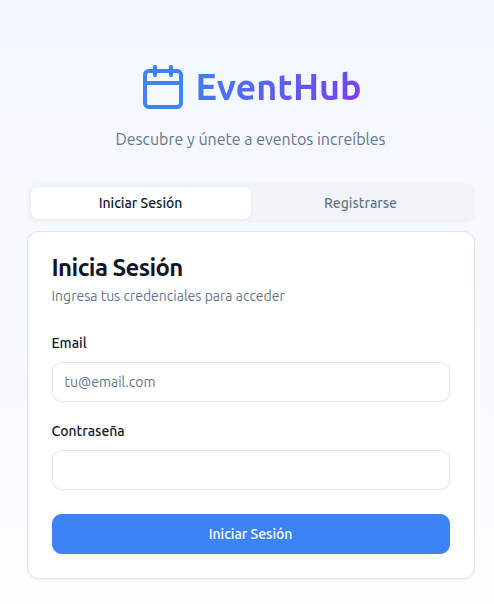
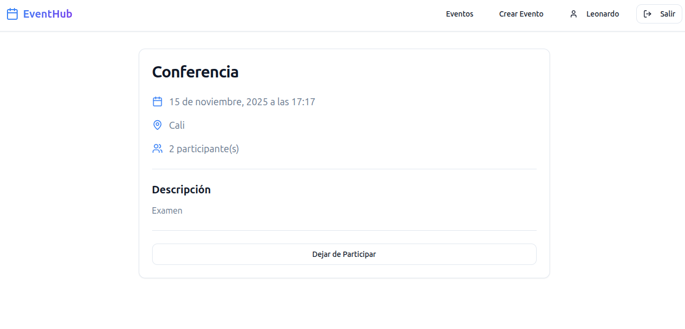

# Taller Individual: Next.js

## Descripción

Este taller tiene como objetivo reforzar los conocimientos adquiridos sobre Next.js. Durante el desarrollo del taller, trabajarás en un proyecto de gestión de eventos donde cada usuario puede crear eventos (nombre, descripción, fecha, ciudad) y otros usuarios pueden registrarse como participantes.

El proyecto debe cumplir con lo siguiente:
- Cada usuario puede crear eventos (nombre, descripción, fecha, ciudad) y otros usuarios pueden registrarse como participantes.
- CRUD de eventos (solo el creador puede editar/borrar).
- Cualquier usuario autenticado puede v er eventos y unirse.
- Un usuario debe ser creado por otro usuario.
- Los passwords no se guardan encriptados.
- Mostrar el listado de eventos con el número de participantes.
- Mostrar el perfil de un usuario con los eventos a los que se ha unido.
- Filtro de eventos por fecha o ciudad.

## Objetivos del Taller

1. **Implementar autenticación de usuarios** (login).
2. **Desarrollar el CRUD completo de eventos** con restricciones de permisos.
3. **Crear el sistema de inscripciones** a eventos.
4. **Implementar filtros y visualizaciones** de datos.
5. **Agregar validaciones** para los campos de entrada.

## Requisitos Previos

Antes de comenzar, asegúrate de tener instalado lo siguiente:

- [Node.js](https://nodejs.org/) (versión 20 o superior).
- Un editor de texto como [Visual Studio Code](https://code.visualstudio.com/).
- Conocimientos de Next.js, React y TypeScript.

## Estructura de la API

### Endpoints

| Recurso        | Método | Endpoint               | Descripción                          |
|----------------|--------|------------------------|--------------------------------------|
| **Users**      | POST   | `/users/`              | Registra un nuevo usuario.          |
|                | GET    | `/users/`              | Lista usuarios.                     |
|                | GET    | `/users/{id}`          | Obtiene los detalles de un usuario. |
|                | POST   | `/login`               | Inicia sesión y obtiene un token.   |
| **Events**     | GET    | `/events`              | Obtiene la lista de eventos.        |
|                | POST   | `/events`              | Crea un nuevo evento.               |
|                | GET    | `/events/{id}`         | Obtiene los detalles de un evento.  |
|                | PUT    | `/events/{id}`         | Actualiza un evento (solo creador). |
|                | DELETE | `/events/{id}`         | Elimina un evento (solo creador).   |
| **Registrations** | POST | `/registrations`      | Registra a un usuario en un evento. |
|                | GET    | `/registrations`       | Lista las inscripciones del usuario.|

**Nota:** Todos los endpoints excepto `/login` requieren autenticación mediante un token.

**Ejemplo de query params:** `/registrations?userId=U002` puede traer las inscripciones del usuario con el userId=U002.

### Estructura de Entidades

```json
// Usuario
{
  "userId": "U001",
  "name": "Juan Pérez",
  "email": "juan.perez@example.com",
  "city": "Bogotá",
  "password": "Hola1234**"
}

// Evento
{
  "eventId": "E001",
  "name": "Encuentro de Inteligencia Artificial",
  "description": "Conversatorio sobre el uso de la IA en empresas colombianas.",
  "date": "2025-12-05T18:00:00Z",
  "city": "Bogotá",
  "createdBy": "U001"
}

// Inscripción
{
  "regId": "R001",
  "eventId": "E001",
  "userId": "U002",
  "registeredAt": "2025-10-10T09:15:00Z"
}
```

## Requisitos Funcionales

### 1. Gestión de Usuarios
- Un usuario puede ser creado por otro usuario autenticado.
- Los campos requeridos son: nombre, email, ciudad y contraseña.
- Las contraseñas se guardan sin encriptar (solo para este ejercicio académico).
- Sistema de login con generación de token.

### 2. CRUD de Eventos
- Cualquier usuario autenticado puede crear un evento.
- Solo el creador del evento puede editarlo o eliminarlo.
- Todos los usuarios autenticados pueden ver la lista de eventos.
- Los eventos deben incluir: nombre, descripción, fecha y ciudad.

### 3. Sistema de Inscripciones
- Cualquier usuario autenticado puede inscribirse a un evento.
- Un usuario no puede inscribirse dos veces al mismo evento.
- Se debe registrar la fecha de inscripción.

### 4. Visualizaciones
- **Listado de eventos:** Mostrar todos los eventos con el número de participantes inscritos.
- **Perfil de usuario:** Mostrar los datos del usuario y los eventos a los que se ha unido.
- **Filtros:** Implementar filtros de eventos por fecha y/o ciudad.

## Instrucciones

1. **Clona el repositorio** del taller en tu máquina local:
    ```bash
    git clone <URL_DEL_REPOSITORIO>
    cd taller_individual_nextjs
    ```

2. **Instala las dependencias** del proyecto:
    ```bash
    npm install
    ```

3. **Configura el proyecto**:
    - Configura Next.js con las rutas necesarias.
    - Implementa la estructura de carpetas adecuada para las paginas y componentes.
    - Crea una libreria para consumir el api.
    - Agrega el .env al repositorio.

4. **Implementa las funcionalidades**:
    - Crea las interfaces de usuario necesarias.
    - Implementa el sistema de autenticación con tokens.
    - Agrega validaciones para todos los campos de entrada.

5. **Implementa los filtros y visualizaciones**:
    - Crea la vista de listado de eventos con contador de participantes.
    - Desarrolla la página de perfil de usuario.
    - Implementa los filtros por fecha y ciudad.

6. **Prueba tu solución**:
    - Verifica que todas las funcionalidades trabajen correctamente.
    - Asegúrate de que las validaciones y los mensajes de error sean claros.
    - Prueba los permisos (solo el creador puede editar/eliminar eventos).

## Entregables

- Código funcional y bien estructurado.  (15%)
- Sistema de autenticación implementado, manejo de estados. (20%)
- CRUD completo de eventos con restricciones de permisos. (20%)
- Sistema de inscripciones operativo. (15%)
- Filtros y visualizaciones funcionando correctamente. (15%)
- Validaciones implementadas en todos los formularios. (15%)

## Evaluación

Se valorará:
- La calidad del código (legibilidad, buenas prácticas, estructura).
- La correcta implementación de las funcionalidades requeridas.
- El manejo adecuado de errores y validaciones.
- La experiencia de usuario (UI/UX).
- El cumplimiento de las restricciones de permisos.

## Entrega

La entrega del taller se realizará a través de [Github Classroom](https://classroom.github.com/). 

### Restricciones

- **No está permitido el uso de GitHub Copilot ni de cualquier otra herramienta de inteligencia artificial generativa** para completar este taller.
- Puedes utilizar tus propios repositorios y recursos disponibles en internet, siempre y cuando cites las fuentes utilizadas.
- El trabajo debe ser completamente individual y original. Cualquier indicio de plagio será motivo de descalificación.

## Pantallazos de la solución

Login:


Listado eventos: 


Crear nuevo evento: 


Página de perfil


Descripción del evento
